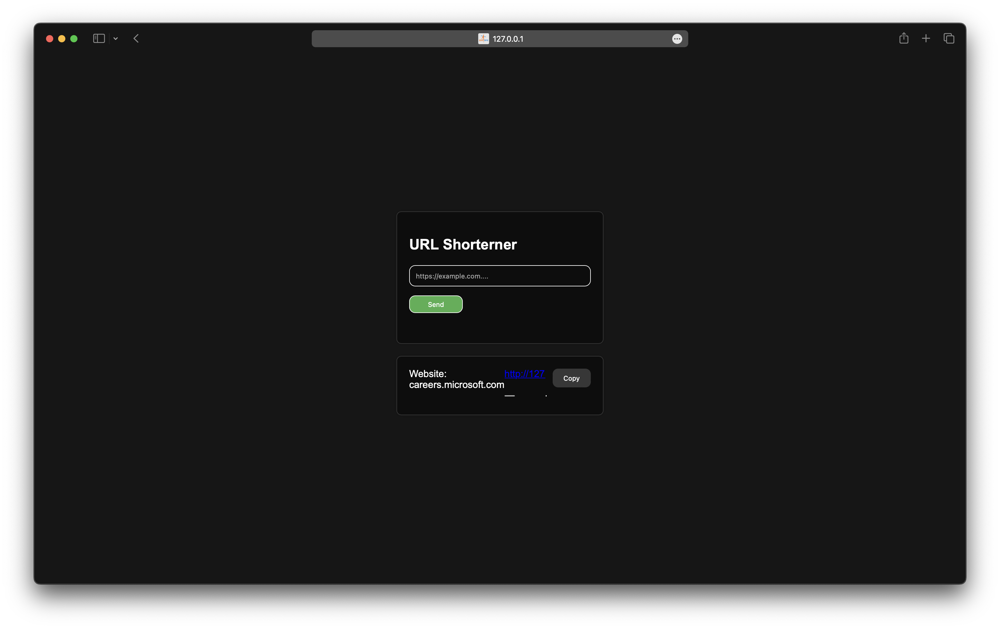

# URLittle

## Overview

Welcome to the URL Shortener project! This web application allows users to easily shorten long URLs and share them with a simple, unique code. The shortened URL can then be used to redirect to the original URL. This project uses Google Sheets as a backend to store and manage the shortened URLs.



## Features

- **Shorten URLs:** Quickly generate a shortened version of any long URL.
- **Unique Codes:** Each shortened URL is assigned a unique 5-character alphanumeric code.
- **Local Storage:** Users can see and manage their own URLs using local storage.
- **Copy to Clipboard:** Conveniently copy the shortened URL to the clipboard.
- **Domain Name Display:** Display the domain name of the original URL.
- **Google Sheets Integration:** Utilizes Google Sheets to store and retrieve URL data.

## Get it on your service

1. Copy this code
    ```HTML
        <script src="https://jatinjha.me/URLittle/script/functionality.js"></script>
        <form method="POST" id="my-form"
            action="https://script.google.com/macros/s/AKfycbxP4O_-zRrbMkU1kVnla0o7Lx3AMd2cENbtOITQ9f4VkdH35QPdaV3W-wkaXDofR1-SOw/exec">
            <h2>URL Shorterner</h2>
            <input name="URL" type="url" placeholder="https://example.com...." required>
            <button type="submit"><p>Shorten</p></button>
            <div id="shortened-link" class="shortened-link"></div>
        </form>
    ```

## Getting Started

### Prerequisites

To run this project, you need a basic understanding of HTML, CSS, and JavaScript. Additionally, you should have a Google account to set up the Google Sheets integration.

### Installation

1. Clone the repository:
    ```sh
    git clone https://github.com/yourusername/url-shortener.git
    cd url-shortener
    ```

2. Set up your Google Sheets with the appropriate columns: `URL` and `Code`.

3. Deploy your Google Apps Script to handle form submissions and data retrieval. Use the following script as a reference:

    ```javascriptconst
    sheetName = 'Sheet1';
    const scriptProp = PropertiesService.getScriptProperties();
    
    function initialSetup() {
      const activeSpreadsheet = SpreadsheetApp.getActiveSpreadsheet();
      scriptProp.setProperty('key', activeSpreadsheet.getId());
    }
    
    function doPost(e) {
      const lock = LockService.getScriptLock();
      lock.tryLock(10000);
    
      try {
        const doc = SpreadsheetApp.openById(scriptProp.getProperty('key'));
        const sheet = doc.getSheetByName(sheetName);

    const headers = sheet.getRange(1, 1, 1, sheet.getLastColumn()).getValues()[0];
    const nextRow = sheet.getLastRow() + 1;

    const newRow = headers.map(function(header) {
      return header === 'Date' ? new Date() : e.parameter[header];
    });

    sheet.getRange(nextRow, 1, 1, newRow.length).setValues([newRow]);

    return ContentService
      .createTextOutput(JSON.stringify({ 'result': 'success', 'row': nextRow }))
      .setMimeType(ContentService.MimeType.JSON);
      } catch (e) {
        return ContentService
          .createTextOutput(JSON.stringify({ 'result': 'error', 'error': e }))
          .setMimeType(ContentService.MimeType.JSON);
      } finally {
        lock.releaseLock();
      }
    }
    
    function doGet() {
      try {
        const doc = SpreadsheetApp.openById(scriptProp.getProperty('key'));
        const sheet = doc.getSheetByName(sheetName);
        const rows = sheet.getDataRange().getValues();
    
        return ContentService
          .createTextOutput(JSON.stringify({ 'result': 'success', 'data': rows }))
          .setMimeType(ContentService.MimeType.JSON);
      } catch (e) {
        return ContentService
          .createTextOutput(JSON.stringify({ 'result': 'error', 'error': e }))
          .setMimeType(ContentService.MimeType.JSON);
      }
    }

    ```

4. Update the form action URL in `index.html` to your deployed Google Apps Script URL.

### Usage

1. Open `index.html` in your preferred web browser.

2. Enter a URL into the input field and click "Send".

3. A shortened URL will be generated and displayed. You can copy it using the "Copy" button.

4. The original domain name will be shown alongside the shortened URL.

## File Structure

- **index.html:** The main HTML file containing the form and output display.
- **styles.css:** The CSS file for styling the application.
- **script.js:** The JavaScript file containing the main logic for URL shortening and local storage management.
- **README.md:** This file.
- **screenshot.png:** A screenshot of the application.

## Contributing

We welcome contributions from the community! To contribute, please follow these steps:

1. Fork the repository.
2. Create a new branch: `git checkout -b feature/your-feature-name`.
3. Make your changes and commit them: `git commit -m 'Add some feature'`.
4. Push to the branch: `git push origin feature/your-feature-name`.
5. Submit a pull request.

## License

This project is licensed under the MIT License - see the [LICENSE](LICENSE) file for details.

## Contact

For questions or feedback, please contact [your-email@example.com](mailto:your-email@example.com).

## Keywords

- URL Shortener
- URL Redirection
- Google Sheets Integration
- Web Application
- JavaScript
- HTML
- CSS

## Acknowledgements

- [Google Apps Script](https://developers.google.com/apps-script) for backend integration.
- [MDN Web Docs](https://developer.mozilla.org/) for web development resources.
- [Stack Overflow](https://stackoverflow.com/) for community support and solutions.

---

By providing a detailed and SEO-optimized README file, you can help users understand your project better and improve its visibility in search engine results. If you have any questions or need further assistance, feel free to ask!


Just a URL shortener
